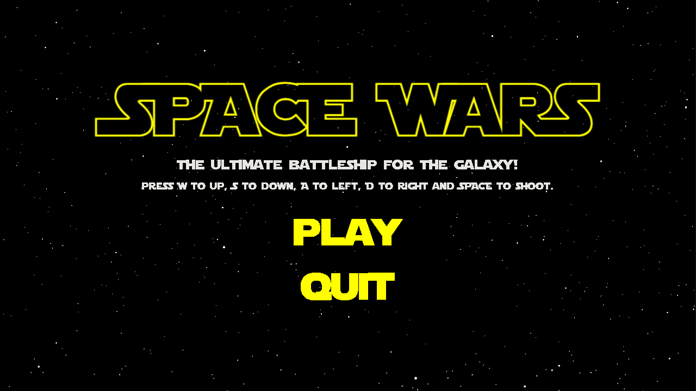
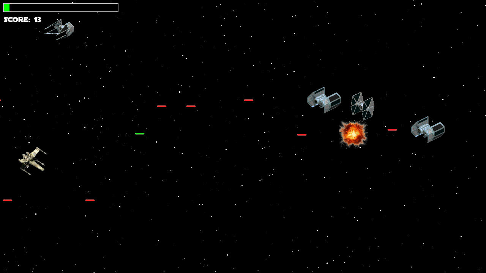
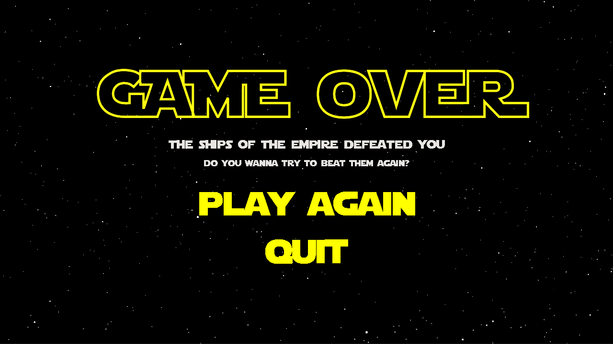

**Space Wars** is an intergalactic, action-packed shooter inspired by the Star Wars universe. Set in the far reaches of space, players must battle waves of enemies, dodge bullet storms, and fight their way to glory among the stars. This game is built with Python and Pygame, and it offers thrilling gameplay with retro vibes.

# ⚙️Requirements
- **Python** 3.8 or later
- **pygame** library

# 📥Installation
To play **Space Wars**, follow these steps:

### Using executable
1. Download `space-wars.zip` from the `Releases` tab and extract it.
1. Run `Space-Wars.exe`.

### Using python directly
1. **Clone the repository**:
   ```bash
   git clone https://github.com/LuanContarin/space-wars-game.git
   cd space-wars
   ```
2. **Install dependencies**: Make sure you have Python and pygame installed. You can install pygame with:
    ```bash
    pip install pygame
    ```
3. **Run the game**:
    ```bash
    python main.py
    ```

# 🎮Controls
- **W**: Move up
- **A**: Move down
- **S**: Move left
- **D**: Move right
- **SPACEBAR**: Shoot (hold for continuous fire with cooldown)

# 🖼️Screenshots






> Let the battle for space dominance begin! 🛸
